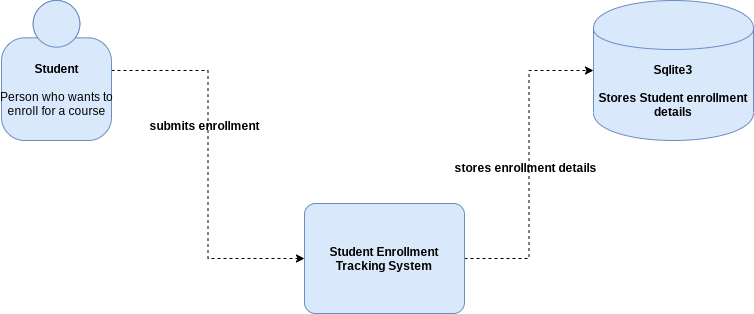
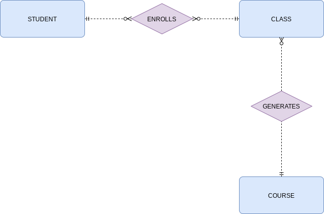

# Small College Anaylsis

### Student Course Enrollment Tracking System Analysis

    - As a student i want to be able to enroll for classes for courses eg: Statistics, History...
      so that i can have a career thats satisfying.

### Functional Requirements

    - The system must allow the student to enroll for classes for courses eg: History, Science...

    - The system must allow the student to view the classes for the courses he's enrolled for with 
      respect to date, time and place.

### Information Requirements

    - Class : date, time and place
    - Student : name, email
    - Course : title, description
    - Enrollment : date, time, grade

### Logical Process Model Represented as DFD

### Analysis Data Model

